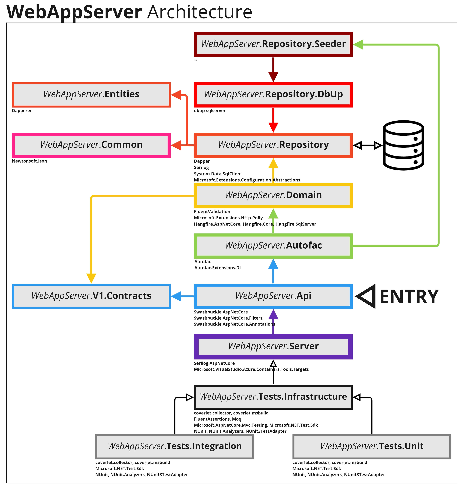

# 'Employee Arrival Tracker' Coding Exercise


## Solution Contents

- src
    - **WebService** - an existing "3rd party" solution which periodically sends reports to its subscribers
        - http://localhost:51396
    - **WebAppServer** - a new BE .NET Web API app which subscribes to WebService, receives reports and stores them in a database
        - https://localhost:7168
    - **webappclient** - a new FE React app which gathers information from WebAppServer and visualizes it in an interactive table
        - http://localhost:3000
- res
    - Postman - a collection of requests for WebAppServer and WebService
    - Comments - comments on the project
	- Images

---

## Proposed Architecture



---

## Startup

### 1. Run **WebService** (existing "3rd party" app)

### 2. Execute the query in SqlServer in order to build an empty database:
```
CREATE DATABASE [EmployeeArrivalTracker]
GO
```
⚠️ WebAppServer uses Hangfire, which needs an existing database to work.

### 3. Run **WebAppServer** (BE Web API server)  
- First, WebAppServer either builds a database using DbUp + predefined SQL scripts or skips this step in case scripts have already been executed (see Program.cs)
- Next, if database is empty (initial run), WebAppServer seeds test data from */Data/employees.json* in the requirements provided by Fourth (see Program.cs)

⚠️ Seeding takes a minute due to the huge file (4000 employees, 5000 team-employee relations, seeded arrivals for the last 5 days).
-
- Next, WebAppServer invokes a *Singleton service 'SubscriptionHandler'* which:
    - builds a http client that calls WebService to subscribe to it (see Program.cs). The token from response is stored in-memory. It is later used as a source-of-truth for incoming data.
        - In case WebService responds with 500 (Internal Server Error), Polly is used in order to retry 5 times, exponentially. 
    - schedules a **single Hangfire job** for 00:05 AM next day which triggers a **recurring Hangfire job**.  
    💡 Every day at 07:00 AM the **recurring Hangfire job** invokes a function which calls WebService and resubscribes to it. The new token from response overrides the old.
- You should now see incoming data from WebService in the Serilog console!

### 4. Run **webappclient** (FE React Client)
- ⚠️ Make sure you have installed the latest *Node Package Manager (npm)* and the latest LTS version of *node.js*  (v16.16.0 at the time of writing)
- Open a console (cmd.exe) from *...\EmployeeArrivalTracker\src\webappclient* and execute the following commands in order to build and start the client project:
```
npm install
npm install -g serve
npm run build
serve -s build
```

---

## Comments

### **WebService (3rd party provider)**

Comments on **JsonEmployeeGenerator** are written down in the Program.cs file of the console application, inline

### **WebAppServer (BE server)**

#### **CORS**

Unfortunately, webappclient failed to call WebAppServer due to CORS issues. That is why in the startup of the web server I have let the use of CORS.  
⚠️ This could be a security issue so it needs further investigation.

### **webappclient (FE client)**

#### **Sorting / Ordering / Paging**

Filtering that was implemented allows selections by:
- 'from date'
- 'to date'
- 'order' (ascending / descending)
- 'page count'  

💡 It would be user friendly to also introduce filtering by 'employee', 'role', 'manager'.  
Unfortunatelly, I could not find time to implement this yet.

---

## Requirements

As a team we are in charge of a new development for the company:

Create a reporting tool that will provide information on a table with data about the time employees arrive to the building.

This Web Application MUST subscribe to a WebService (provided in the solution already) to do the following:
- Receive and store information about a bus stop located in front of the company's office.
- Allow a user to see a report with the received information

In order to subscribe to the service, compile the solution, and run the project WebService in the background

Send a request to the endpoint

`http://localhost:51396/api/clients/subscribe?date=2016-03-10&callback={URI}`

with the (*MANDATORY*) header:

`Accept-Client: "Fourth-Monitor"`

with the (*MANDATORY*) parameters:

`date`: date of the required simulated data in the format yyyy-MM-dd

`callback`: url where the webservice will submit the data

Possible responses:

`401 unauthorized`

`200 Ok` // with a body

`{
	"Token":"XXX",
	"expires":"DATE" //ISO 8601 format
}`

If the response status is 200:

The service will start sending requests to provided callback in the url, until it fails after 10 retries or the simulation is finished for the provided date (all the information for that date has been submited)
Every request will contain a header X-Fourth-Token with the provided token, and this has to be validated in order to receive valid submissions of data, header must exist and be the same as the one in the response to the subscription.

The callback has to accept POST messages receiving the following json list

`{
	[  { "EmployeeId" : X , "When" : "2016-04-01T14:35:20Z" }	]
}`

- *EmployeeId*: int
- *When*: DateTime valid ISO 8601 format

*It is required to pass the test that you*

- Fork the master branch.
- Introduce changes implementing the following
    - A database to store the information (Employees and Arrival information)
    - The Web Application to connect to the webservice, and accept information about the employees arriving to the bus stop.
     - Every time the WebService makes a request to your application save the information in the database
     - Create a web page where the information is presented in a table to the user (allow filtering/sorting)
- If required add any comments in a file in the Comments folder.

- In the folder Comments create 1 file (MANDATORY) with

	A review of the code of the JsonEmployeeGenerator, proposing changes inline the code to improve the code quality and performance

- Create another file with (THIS IS A BONUS, NOT MANDATORY):

Make a proposal of an architectural change of the WebService to improve reliability

Unit tests will be considered as advantage
